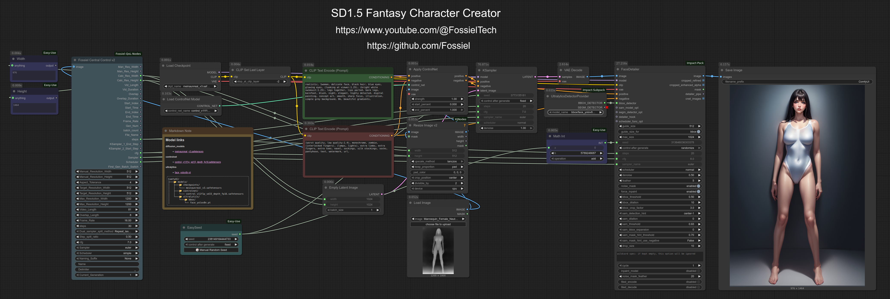

# Fossiel ComfyUI Workflows

This repo houses workflows for ComfyUI. They will eventually range in difficulty from very simple to very advanced. Due to my system constraints, these workflows are speceifically geared towards low VRAM usage. If your rig has similar specs to mine, they wil work fantastically for you.

#### My System Specs:
12th Generation i7 Laptop
32GB System RAM
Nvidia RTX3050(mobile) with 4GB VRAM

## Workflows:

### SD1.5 Fantasy Character Creator v1.0

While newer image generation models have improved dramatically in both output quality and prompt adherence, Stable Diffusion 1.5 models still generate the most ridiculously pretty women of all open source AI models with minimal effort required by the user. This workflow uses the meinaunreal_v3 model and its prompt adherence may be abysmal but it generates unique, fantastically pretty women.  

Drag the image below into ComfyUI to load the workflow.  

Tip: To introduce variation in facial features of generated characters, add the name of a well known celebrity or fashion supermodel to the positive prompt.  

## History
2025/10/26 – Added SD1.5 Fantasy Character Creator v1.0 workflow.

## Credits
- All the developers who make tools available to everyone using local AI
- Model developers for supplying fantastic open source models, free of charge.
