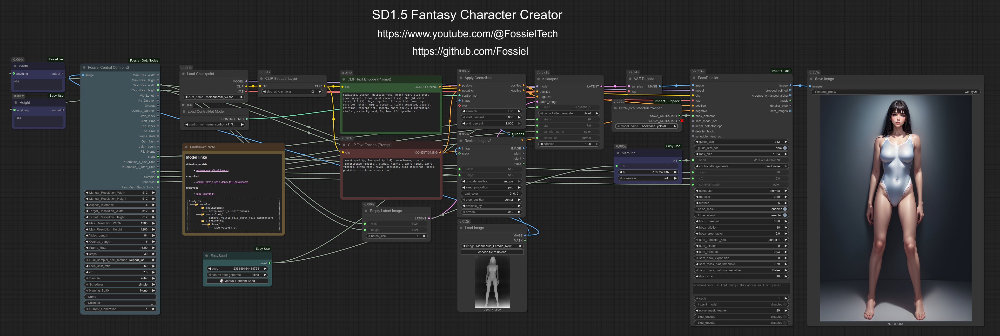
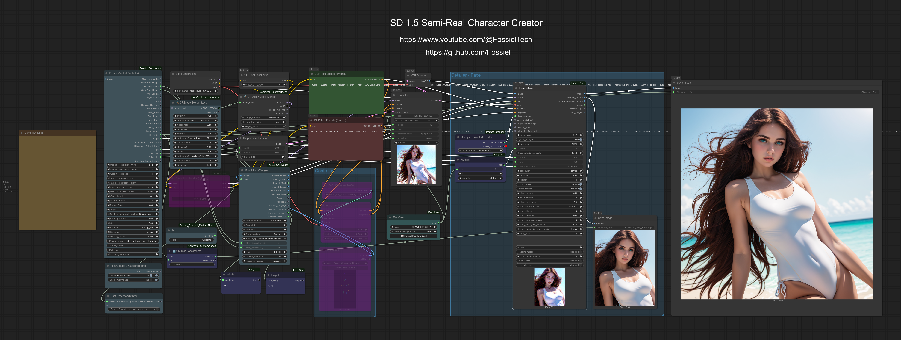
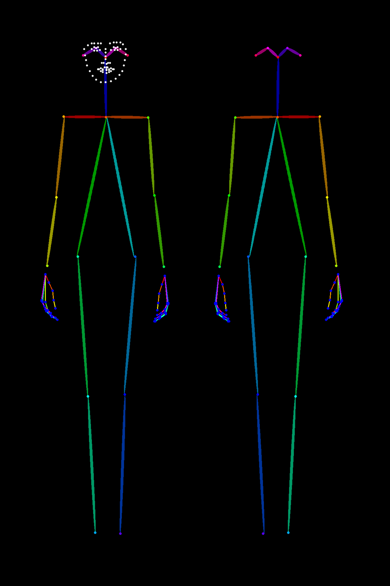

# Fossiel ComfyUI Workflows
This repo houses workflows for ComfyUI. They will eventually range in difficulty from very simple to very advanced. It hasn't received much love but that's about to change.
---
# Important: Please Read If You Use These Workflows  

I share these ComfyUI workflows completely for free because I believe in paying forward — **no paywalls, no exclusive Discords, no gatekeeping**.

My main goal is to get more eyes on my work so I can grow my **GitHub** and **YouTube channel** (and maybe eventually turn this into something sustainable like commissions or Patreon).  
A small credit goes a really long way toward that — it costs you almost nothing but helps me a ton.

**If you use, modify, or feature any of these workflows, I'd be very grateful if you could follow these simple courtesies:**

- **Link to this repo** instead of re-uploading / redistributing the .json or .png files elsewhere (Civitai, Reddit, Discord shares, etc.).  
  This keeps views, stars, and feedback centralized here.

- **Give credit** in video descriptions, titles, posts, or workflow notes:  
  e.g. "Workflow based on / inspired by Fossiel's work → https://github.com/Fossiel/Fossiel-ComfyUI-Workflows"  
  or "@Fossiel on GitHub / @FossielTech on YouTube — check out the original here!"

- **Please don't** put these (or close derivatives) behind any paywall, sell access, or include them in paid bundles/courses.

If you do something cool with one of these, feel free to tag me or drop a link — I love seeing what people create and I'm happy to share / shout out good uses!

Thanks so much for respecting this — it keeps free high-quality workflows flowing for everyone. 🙏  
---
Due to my system constraints, these workflows are specifically geared towards low VRAM usage. If your rig has similar specs to mine, these workflows should work fantastically for you as well.

#### My System Specs:
- 12th Generation i7 Laptop
- 32GB System RAM
- Nvidia RTX3050(mobile) with 4GB VRAM

## Workflows:

### SD1.5 Fantasy Character Creator v1.0

While newer image generation models have improved dramatically in both output quality and prompt adherence, Stable Diffusion 1.5 models still generate the most ridiculously pretty women of all open source AI models with minimal effort required by the user. This workflow uses the meinaunreal_v3 model and its prompt adherence may be abysmal but it generates unique, fantastically pretty women.  

Drag the image below into ComfyUI to load the workflow.  

Tip: To introduce variation in facial features of generated characters, add the name of a well known celebrity or fashion supermodel to the positive prompt.  

---

### SD1.5 Semi-Real Character Creator v1.0

This workflow uses an SD1.5 model stack to produce "semi-realistic" characters. Warped limbs are this sport's injuries but the workflow runs very fast and good generations happen frequently. On the plus side, the characters generated have such a high level of consistency that they have to be forced into looking differently. To accomplish this, add pre-SD1.5 (<2022) celebrity names to the prompt in the format `(Celebrity Name:1.0)` and adjust the strength after the colon. Multiple names can be added to make amalgamated changes. Use this ethically by only affecting the output and not actually trying to copy the celebrity's face.  

Drag the image below into ComfyUI to load the workflow.  

Using the image below as pose driver in combination with the models listed in the workflow, will almost always produce women with and hourglass figure and slightly elongated legs. This results in that super model look. The image has a front and a back next to each other but SD1.5 doesn't understand "back" well and produces 2 front-facing characters. Ironically, this helps getting to a really good generation in half the time.  

---

## History
- 2026/03/20 – Added SD1.5 Semi-Realistic Character Creator v1.0 workflow.  
- 2025/10/26 – Added SD1.5 Fantasy Character Creator v1.0 workflow.  

## Coming Soon:
- Z-Image-Turbo Character Creator.
- Low VRAM Qwen Edit Plus Workflow.  
- Practical use of WAN2.2 on potatoes.  

## Credits
- All the developers who make tools available to everyone using local AI  
- Model developers for supplying fantastic open source models, free of charge.  
